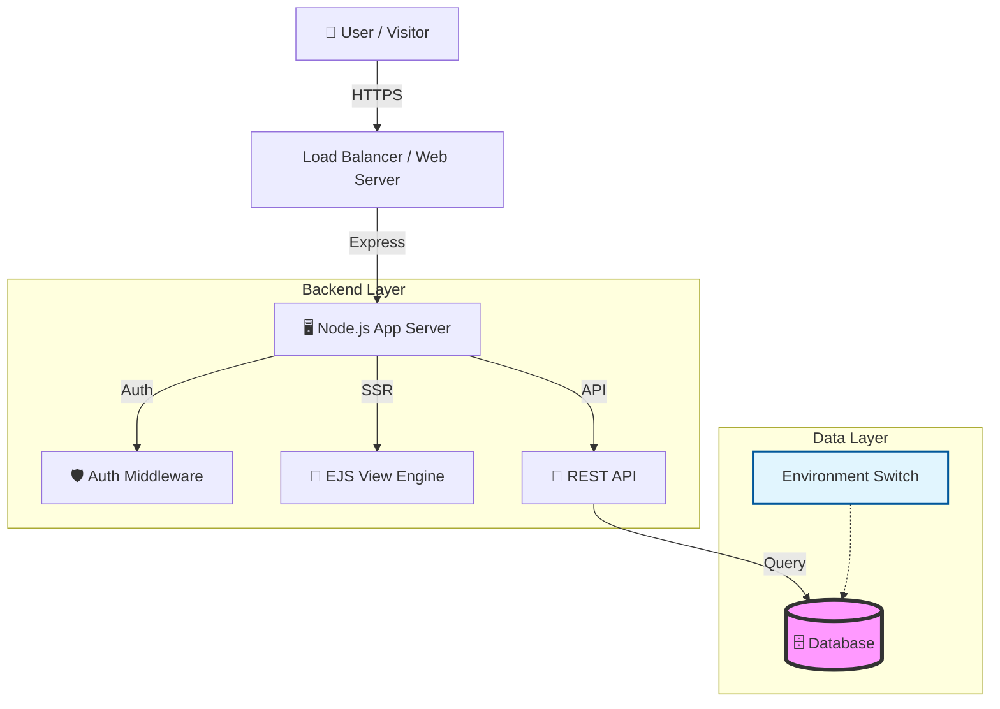

# ⚜️ ボーイスカウト多治見第一団 公式ウェブサイト

[](https://opensource.org/licenses/ISC)
[](https://nodejs.org/)
[](https://expressjs.com/)
[](https://tailwindcss.com/)
[](https://www.postgresql.org/)

> **「自然の中で、仲間と共に育つ。」**  
> ボーイスカウト多治見第一団の活動を支え、地域社会へ発信するためのモダンなWebプラットフォーム。

---

## 📖 目次

- [📌 プロジェクト概要](#-プロジェクト概要)
- [🏗 アーキテクチャ](#-アーキテクチャ)
- [✨ 主な機能](#-主な機能)
- [🛠 技術スタック詳細](#-技術スタック詳細)
- [💻 セットアップ & 開発ガイド](#-セットアップ--開発ガイド)
- [📂 ディレクトリ構造](#-ディレクトリ構造)
- [🔌 API リファレンス (簡易版)](#-api-リファレンス-簡易版)
- [🚀 デプロイ](#-デプロイ)
- [❓ トラブルシューティング](#-トラブルシューティング)

---

## 📌 プロジェクト概要

このリポジトリは、ボーイスカウト多治見第一団の公式ウェブサイト兼コンテンツ管理システム（CMS）です。
一般ユーザー向けの**情報発信機能**と、指導者が手軽に更新できる**管理機能**を統合しています。

サーバーサイドレンダリング（SSR）による高速な初期表示とSEO対策、そしてSPAライクな管理画面による操作性を両立させています。

---

## 🏗 アーキテクチャ

本システムは、環境に応じて柔軟に構成を変えるハイブリッドな設計を採用しています。



*   **Development**: 設定不要な `SQLite` と `session-file-store` で即座に開発可能。
*   **Production**: 堅牢な `PostgreSQL` と `connect-pg-simple` に自動切り替え。

---

## ✨ 主な機能

### 🌏 公開フロントエンド
*   **ダイナミックトップページ**: 最新の活動ログとニュースを自動集約して表示。
*   **レスポンシブUI**: Tailwind CSS によるモバイルファースト設計。
*   **SEO最適化**: 各ページで適切なメタタグと構造化データを出力。
*   **各隊ページ**: ビーバーからローバーまで、各部門の個別の活動紹介ページ。

### 🔐 管理ダッシュボード (`/admin`)
*   **統合CMS**: ニュース記事、活動記録の一元管理。
*   **メディア管理**: ドラッグ＆ドロップによる画像アップロードとプレビュー。
*   **サイト設定エディタ**: 住所や連絡先、SEO設定などをコード修正なしで変更可能。
*   **セキュリティ**: `bcrypt` によるハッシュ化とセッションベースの認証。

---

## 🛠 技術スタック詳細

| カテゴリ | テクノロジー | 採用理由 |
| :--- | :--- | :--- |
| **Runtime** | **Node.js** | 非同期I/Oによる高い並行処理能力。 |
| **Framework** | **Express v5** | 柔軟性が高く、ミドルウェアエコシステムが豊富。 |
| **View Engine** | **EJS** | シンプルな構文でHTMLを動的に生成。学習コストが低い。 |
| **Styling** | **Tailwind CSS** | ユーティリティファーストで、迅速なUI構築が可能。 |
| **Database** | **PostgreSQL / SQLite** | 本番の堅牢性と開発の手軽さを両立するアダプタパターン実装。 |
| **Scripting** | **Alpine.js** | jQueryの代替として、宣言的かつ軽量にDOM操作を実現。 |

---

## 💻 セットアップ & 開発ガイド

### 1. 前提条件
*   Node.js `v18.0.0` 以上
*   npm `v9.0.0` 以上

### 2. インストール

```bash
# リポジトリのクローン
git clone https://github.com/aptmara/boyscout-tajimi.git
cd boyscout-tajimi

# 依存関係のインストール
npm install
```

### 3. 環境設定 (`.env`)
プロジェクトルートに `.env` ファイルを作成します。

```ini
# アプリケーション設定
PORT=3000
NODE_ENV=development

# データベース接続 (開発時はSQLiteを使用するため空欄または 'sqlite:' でOK)
DATABASE_URL=sqlite:

# セキュリティ (推測困難な文字列を設定してください)
SESSION_SECRET=your_super_secret_session_key_CHANGE_ME

# 初回管理者セットアップ (db:setup実行時に作成されます)
INITIAL_ADMIN_USERNAME=admin
INITIAL_ADMIN_PASSWORD=password123
```

### 4. 初期化と起動

```bash
# 1. データベースの初期化 (SQLiteファイルまたはPGテーブルの作成)
npm run db:setup

# 2. 開発サーバーの起動
npm run start:dev
```

ブラウザで `http://localhost:3000` にアクセスしてください。
管理画面は `/admin/login.html` からアクセスできます。

---

## 📂 ディレクトリ構造

重要なファイルとフォルダの役割を解説します。

```text
boyscout-tajimi/
├── 📂 src/
│   ├── 📂 server/                # バックエンドロジックの中核
│   │   ├── 📄 server.js          # アプリケーションのエントリポイント
│   │   ├── 📄 database.js        # DB接続ラッパー (SQLite/PG抽象化層)
│   │   ├── 📂 routes/            # ルーティング定義 (API & View)
│   │   ├── 📂 controllers/       # ビジネスロジック
│   │   └── 📂 middleware/        # 認証・エラーハンドリング
│   ├── 📂 views/                 # EJSテンプレート (フロントエンド)
│   │   ├── 📂 layouts/           # 共通レイアウト (main.ejs)
│   │   ├── 📂 pages/             # 各ページの実体
│   │   └── 📂 partials/          # 再利用可能なコンポーネント
│   └── 📂 styles/                # Tailwind CSS ソースファイル
├── 📂 public/                    # 静的アセット (ブラウザから直接アクセス可能)
│   ├── 📂 styles/                # ビルド済みCSS
│   └── 📂 admin/                 # 管理画面用静的HTML
└── 📄 package.json               # 依存関係定義
```

---

## 🔌 API リファレンス (簡易版)

主な内部APIのエンドポイントです。すべてのAPIは `/api` プレフィックスを持ちます。

| メソッド | エンドポイント | 説明 | 認証 |
| :--- | :--- | :--- | :---: |
| `GET` | `/api/news` | ニュース記事一覧を取得（ページネーション対応） | 不要 |
| `GET` | `/api/activities` | 活動記録一覧を取得 | 不要 |
| `GET` | `/api/settings` | 公開されているサイト設定を取得 | 不要 |
| `POST` | `/api/login` | 管理者ログイン | - |
| `POST` | `/api/admin/news` | 新しいニュース記事を作成 | **必要** |
| `PUT` | `/api/admin/settings` | サイト設定を更新 | **必要** |

---

## 🚀 デプロイ

このプロジェクトは、**Render** や **Heroku**、**Vercel (Serverless Function)** などのPaaS、またはVPSへのデプロイに対応しています。

### Render.com の場合
1.  New Web Service を作成。
2.  Build Command: `npm install && npm run build`
3.  Start Command: `npm start`
4.  Environment Variables に `DATABASE_URL` (Internal Connection String) 等を設定。

---

## ❓ トラブルシューティング

**Q. `npm run db:setup` でエラーが出る**
> A. プロジェクトルートに書き込み権限があるか確認してください。SQLiteモードでは `database.sqlite` ファイルを作成しようとします。

**Q. CSSが反映されない**
> A. `npm run build:css` を実行して Tailwind CSS を再コンパイルしてください。開発中は `npm run start:dev` とは別に、ウォッチモードでCSSビルドを走らせることを推奨します。

**Q. 本番環境で画像が表示されない**
> A. アップロードされた画像はデフォルトでローカルディスク (`src/server/uploads`) に保存されます。PaaS (Render/Heroku) の無料プラン等はディスクが一時的(Ephemeral)なため、再起動で消えます。永続化が必要な場合は、S3やCloudinaryへの保存処理に変更するか、永続ディスクをマウントしてください。

---

_Maintained by the Boy Scout Tajimi Team_